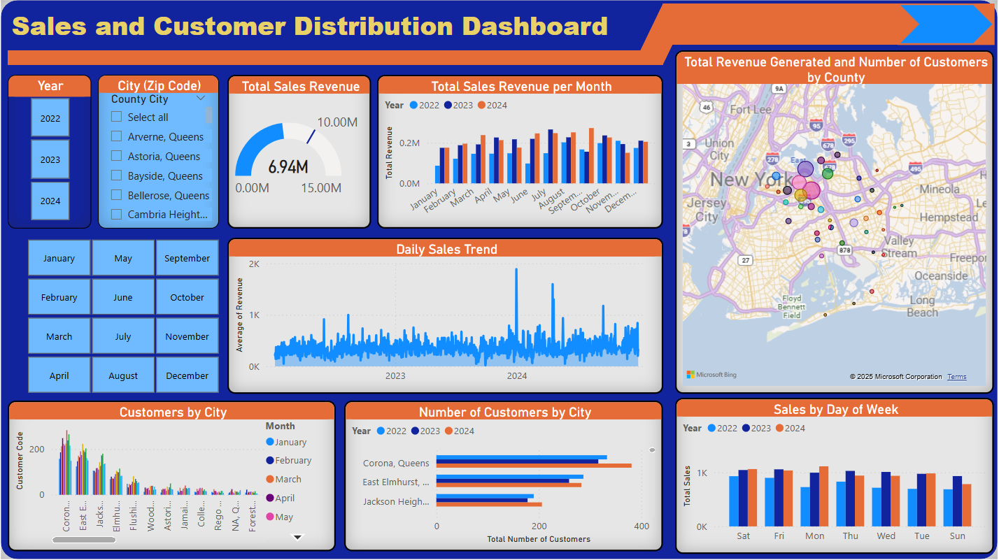
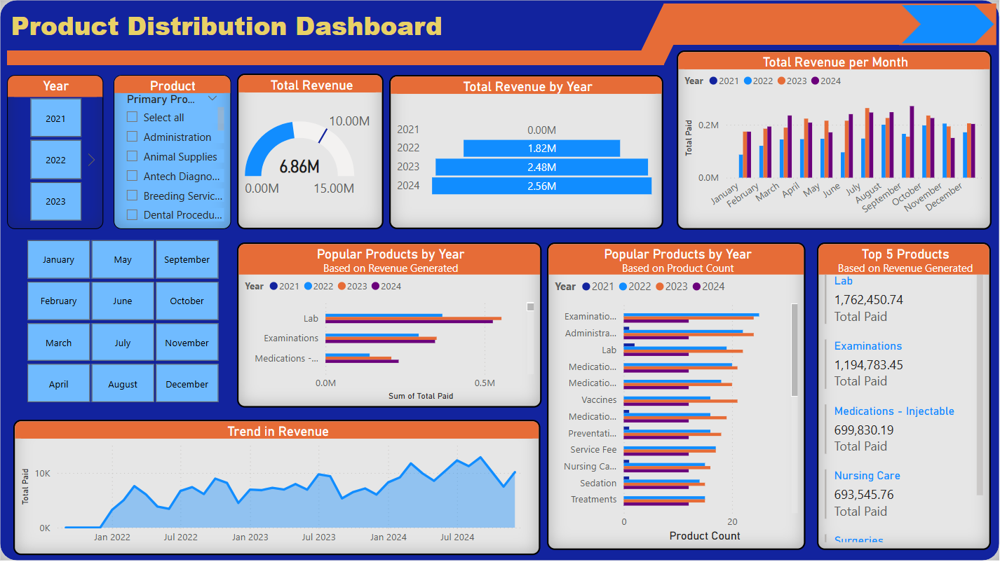

# Business Analytics Dashboard – Power BI  

## 📊 Overview  
This **Business Intelligence Dashboard** provides a comprehensive analysis of a company's performance across multiple locations in **Queens, New York**. Built using **Power BI**, the dashboard tracks key business metrics, revenue growth, customer distribution, sales trends, and product performance across various service categories. 

## 🔹 Key Features  
- **Total Revenue Growth** – Revenue increased to **$2.56M in 2024**.  
- **Customer Distribution** – Breakdown by city and location to identify key markets.  
- **Sales Trends** – Analysis of sales patterns by **day of the week** and seasonal fluctuations.  
- **Product Performance** – Revenue and usage insights for **lab work, examinations, medications, and nursing care**.  
- **Geographic Insights** – Interactive map visualizations to explore revenue distribution.  

## 📂 Dashboard Views  
1. **Sales & Customer Distribution** – Geographic-based sales analysis.  
     
2. **Product Performance & Revenue Trends** – Service category analysis and revenue breakdown.  
     

## 🚀 How to Use  
1. **Open Power BI Desktop** and load the `.pbix` file from the `Business-Analytics` folder.  
2. **Explore Interactive Visuals** – Use filters to drill down into specific time periods, locations, or product categories.  
3. **Gain Insights** – Identify revenue drivers, high-performing products, and key customer segments.  

## 🛠 Tools & Technologies  
- **Power BI** – Data visualization and dashboard creation.  
- **Power Query (M Language)** – Data transformation and cleansing.  
- **DAX (Data Analysis Expressions)** – Custom measures and calculations.  
- **Excel & CSV** – Data sources for analysis.  

## 📧 Contact  
For questions, contributions, or feedback, reach out via **[your email or LinkedIn]**.  

🚀 **Turn insights into action with data!**
